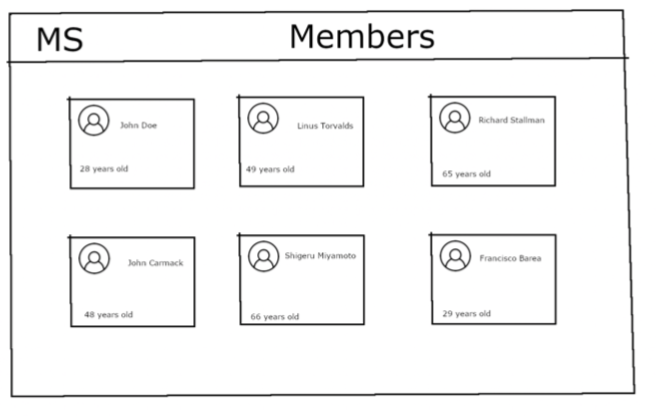
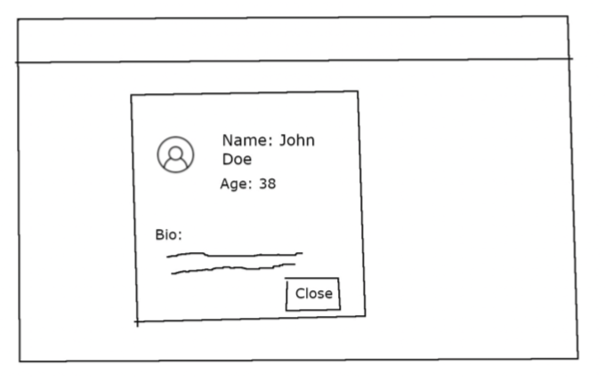

# Mediasmart coding test

We have a database of the members in the company that our CEO uses internally. The information
of the database is accessed using this (old) endpoint:

```
http://work.mediasmart.io/
```

Which returns a list of members with its info updated every night at 00:30 AM UTC. This endpoint has some issues:
- It has uncontrollable delays that can harm the User experience of the application you have to build (maybe solvable using a cache in the back-end?)
- Some images are broken and some data is incorrect, please take care about this for us :).

Now, to modernize things a bit, we want to build a web application to easily filter and review the
members. This app should:

- List all members in the database and show them in a grid on the UI. Every item in the grid will
contains: Image, Name & Age of the user.
- On clicking on an item on the grid, the full profile of the member will be shown, containing:
Name, Image, Age and the full bio of the user.
Our marvelous designer has sent us some mockups of how the UI should look like. See next
attached pictures.

Therefore:
Build a web application (backend & frontend) in Javascript that fulfill the above requirements. Note
that:
- When calling the above endpoint, use the backend side of the app.
- This app is going to be used from several devices: mobile phones, tablets, laptops...
- You can use the frameworks, libraries & tools that you want.

### Mockups

Here we suggest you a way to display the data fetched from the endpoint

List view



Profile view



## Where to begin
If you whish you can use as a boilerplate this example app that we provide you bootstrapped with [Create React App](https://github.com/facebook/create-react-app).

### Available Scripts

Install dependencies with:

```
npm install
```

In the project directory, you can run:

```
npm start
```

Runs the whole app in the development mode.

- Client will be running on [http://localhost:3000](http://localhost:3000).
- Server will be running on [http://localhost:5000](http://localhost:5000).

Both will reload if you make changes in the code.

### Learn More

To learn React, check out the [React documentation](https://reactjs.org/).

## Submission

Once finished, please, email us the solution with the code in a git repo:

Subject:
"Software Engineer Assessment: <your name>"

Address:
jobs@mediasmart.io

Of course, if you have any question, don't hesitate to ask!

Good luck!

